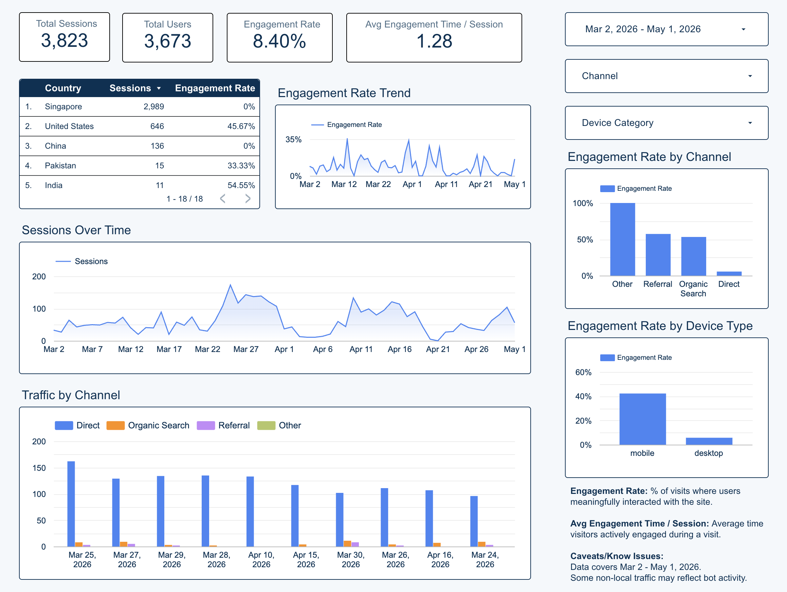

# Problem

## Who is NCMA SGV?

::: {.fragment .fade-up}
NCMA SGV is a **nonprofit, membership-based professional association chapter** that serves contract management professionals, students, and early-career talent across the San Gabriel Valley.
:::

::: {.fragment .fade-up}
The chapter creates value through **professional development events, educational programming, networking, certification support, and leadership engagement**.
:::

::: {.fragment .fade-up}
But like many local chapters, NCMA SGV depends on a digital presence — a website, social events, and email — to find new members and keep current ones engaged.
:::

## The Strategic Question

::: {.fragment .fade-up}
NCMA SGV wants to **grow its local community**, especially among Gen Z and early-career professionals, while keeping established members active.
:::

::: {.fragment .fade-up}
The chapter is doing the work — running events, sending content, maintaining a website. The question is whether that effort is **actually reaching the right audience**.
:::

::: {.fragment .fade-up}
**The core business problem:** *Are NCMA SGV's website and digital channels successfully attracting, engaging, and converting the right people — particularly U.S. professionals in the San Gabriel Valley?*
:::

## What We Need to Measure

::: {.fragment .fade-up}
To answer that, we need visibility into the **full user journey**: acquisition → engagement → conversion → retention.
:::

::: {.fragment .fade-up}
That means tracking traffic source, country, device, landing-page engagement, event registrations, subscription conversions, and returning users — all in one stable view.
:::

::: {.fragment .fade-up}
Today, the chapter has the data in GA4 but no consolidated picture. **Our job was to turn raw GA4 data into a decision-ready story.**
:::

# Data Findings

::: {.columns}

::: {.column width="50%"}
{width="100%"}

[View Looker Studio Dashboard](https://datastudio.google.com/reporting/4666a95f-b65f-4ebd-bba3-ebf05ed9b699)
:::

::: {.column width="50%"}

::: {.fragment .fade-up}

**Key Findings:**

- Traffic is dominated by Direct, but shows low engagement, indicating low-intent users or tracking gaps.  
- Organic and Referral drive higher engagement, suggesting more qualified users.  
- Traffic is heavily concentrated in Singapore, misaligned with the U.S.-based target audience.  
- Desktop drives volume, but mobile users are more engaged.  
- Traffic is inconsistent over time, likely driven by specific events rather than steady growth.  

:::

:::

:::

# Limitations

::: {.fragment .fade-up}
**Main caveats:**

- Analysis relies on aggregated dashboard and GA4-style reporting; user-level journeys limited

- Direct traffic dominates the data; may reflect real brand visits, but may also signal tracking or UTM gaps

- Geographic traffic heavily concentrated outside the expected U.S.-based target audience, especially Singapore

- Attribution results should be treated as directional, not exact proof of causation

- Analysis window may be too short to fully capture seasonality, campaign cycles, or long-term patterns\
:::

# Recommendations & Next Steps

::: {.fragment .fade-up}
**Recommended actions:**

- Strengthen tracking by standardizing UTMs, event names, and key conversion actions

- Investigate the source of Singapore-heavy traffic and filter or segment it when reporting to stakeholders

- Shift attention toward channels with stronger engagement, especially Organic and Referral

- Use attribution reporting alongside last-click metrics to better understand assisted conversions

- Build a recurring review process so the dashboard becomes a decision tool, not just a reporting artifact\
:::
